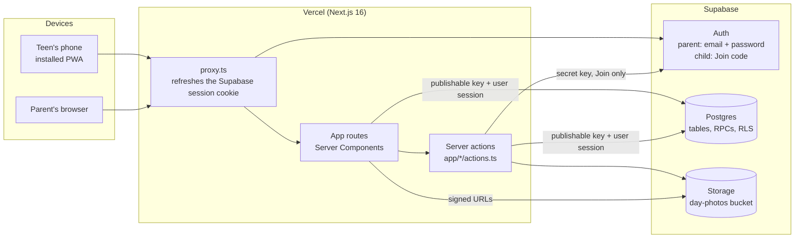
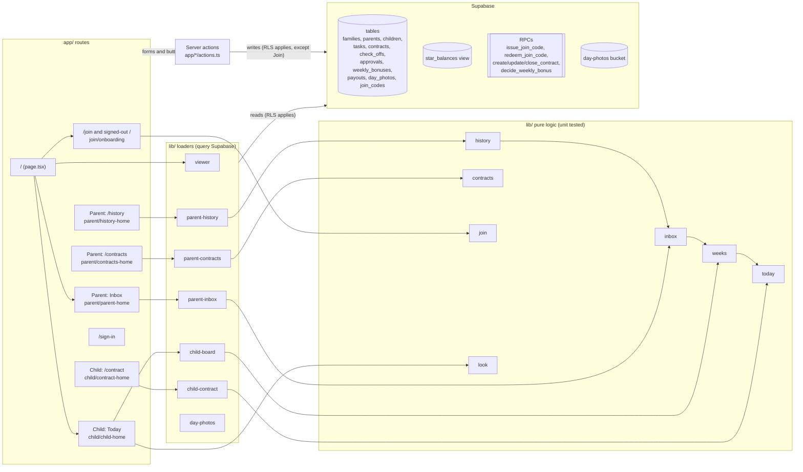
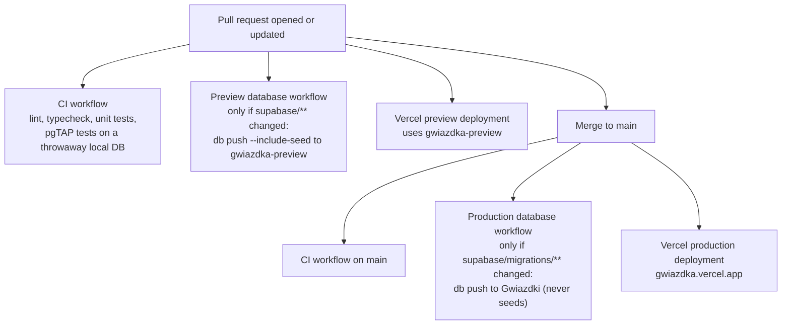

# Architecture

What Gwiazdki is made of and how the parts fit together. For the words (Task, Check-off, Approval, Contract…) see [`CONTEXT.md`](../CONTEXT.md).

In one paragraph: a Next.js app on Vercel renders every screen on the server. It talks to Supabase (Auth, Postgres, Storage) with the signed-in person's own session, so **Row Level Security in Postgres is what decides who may see and change what**. The app code mostly reads rows, turns them into screen data with pure functions in `lib/`, and writes through server actions. GitHub Actions run the checks and push database migrations; Vercel builds the app itself.

## Runtime

- **Every request** goes through `proxy.ts` (Next 16's name for middleware), which refreshes the Supabase session and writes the new cookies back. Static files and icons skip it.
- **Pages** are Server Components. `lib/viewer.ts` looks at the session and answers "parent, child or nobody", and `/` renders the parent's Inbox, the child's Today, or the signed-out welcome from that.
- **Server actions** do all writes: Check-offs, Approvals, Weekly bonus decisions, Contracts, photos, sign-in and Join.
- **Two Supabase clients on the server.** `lib/supabase/server.ts` carries the user's cookies, so RLS applies; almost everything uses it. `lib/supabase/admin.ts` uses the secret key and bypasses RLS; only `joinWithCode` in `app/join/actions.ts` uses it, to redeem a code and mint the child's session. `lib/supabase/client.ts` (browser client) exists but nothing imports it today.
- **Time** is Warsaw time, decided in the database: `private.clock()` and `private.today()` in the first migration. The 22:00-next-day Check-off deadline is enforced by RLS, not by the app.
- **Cookies** also hold small per-device choices: the teen's theme and accent (`lib/look.ts`), the last Contract seen (`lib/contract-seen.ts`) and a hidden week recap (`lib/recap.ts`).
- **Photos** live in the private `day-photos` bucket as `<child_id>/<day>.jpg`. Pages hand out one-hour signed URLs (`lib/day-photos.ts`); the Payout deletes them.

### Which Supabase project each environment uses

| Environment | App runs on | Supabase | Data |
|---|---|---|---|
| Local | `npm run dev` on your machine | local stack from `npx supabase start` (Docker) | `supabase/seed.sql` fake family |
| Preview | Vercel preview per PR (behind Vercel login) | `gwiazdka-preview` | `seed.sql` fake family, pushed by the Preview database workflow |
| Production | https://gwiazdka.vercel.app | `Gwiazdki` | the real family, added once by hand from `supabase/production-family.example.sql` |
| CI | GitHub Actions runner | local stack started inside the job | pgTAP fixtures in `supabase/tests/database/` |

All Supabase projects are in eu-west-1.

## Code

Routes on the left, the `lib/` modules that load and shape their data in the middle, the database on the right. Loaders query Supabase and hand the rows to pure modules, which have no Supabase import and carry the unit tests. The tables below say which action writes what.

What writes where (all in server actions):

| Action file | Does | Touches |
|---|---|---|
| `app/child/actions.ts` | `setCheckOff`, `savePhoto`, `removePhoto` | `check_offs`, `day_photos`, `day-photos` bucket |
| `app/parent/actions.ts` | `decide`, `approveAll`, `approveUndecided`, `decideWeeklyBonus`, `issueJoinCode` | `approvals`, RPCs `decide_weekly_bonus`, `issue_join_code` |
| `app/parent/contract-actions.ts` | `createContract`, `updateContract`, `closeContract` | RPCs `create_contract`, `update_contract`, `close_contract`; removes paid-out photos from the bucket |
| `app/join/actions.ts` | `joinWithCode` | RPC `redeem_join_code`, Auth admin (secret key), `children.user_id` |
| `app/sign-in/actions.ts` | `signIn`, `signOut` | Auth |

The schema is the migrations in `supabase/migrations/`, in date order; [`database.md`](database.md) explains every table, the RLS rules and how to connect. RLS helpers live in the `private` schema (for example `private.child_may_check_off`, `private.parent_may_decide`), and the pgTAP tests in `supabase/tests/database/` pin down what each role may do.

## Dependencies

From `package.json`. Node 22 or newer.

| Package | Why it's here |
|---|---|
| `next` | The app framework: routes, Server Components, server actions, `proxy.ts`. Version 16 differs from older Next.js; read `node_modules/next/dist/docs/` before changing framework code. |
| `react`, `react-dom` | UI rendering for Next.js. |
| `@supabase/supabase-js` | Supabase client: queries, RPCs, Storage, and the admin client used by Join. |
| `@supabase/ssr` | Supabase clients that keep the session in cookies, for the proxy and Server Components. |
| `server-only` | Makes the build fail if a server-only module (the admin client, `lib/viewer.ts`) is imported into browser code. |
| `lucide-react` | Line icons: Task icons, the teen's screens and the Join screens. |
| `uqr` | Draws the QR code on the parent's Join code sheet, on the server. |

Development only:

| Package | Why it's here |
|---|---|
| `typescript`, `@types/*` | Type checking (`npm run typecheck`). |
| `eslint`, `eslint-config-next` | Linting (`npm run lint`). |
| `tailwindcss`, `@tailwindcss/postcss` | Styling, compiled through PostCSS. |
| `vitest` | Unit tests for the pure `lib/` modules (`npm test`). |
| `supabase` | The Supabase CLI: local stack, pgTAP tests, and `db push` in the workflows. |

## External services

Names only; values live in the services, never in the repo.

| Service | What lives there |
|---|---|
| **Vercel** | Builds a preview per PR and deploys production from `main` through its GitHub integration (no workflow file). Env vars per environment: `NEXT_PUBLIC_SUPABASE_URL`, `NEXT_PUBLIC_SUPABASE_PUBLISHABLE_KEY`, `SUPABASE_SECRET_KEY`. Preview points at `gwiazdka-preview`, Production at `Gwiazdki`. Previews are behind Vercel login. |
| **Supabase** | Two hosted projects: `Gwiazdki` (production) and `gwiazdka-preview`. Each has its Auth users, Postgres and the `day-photos` bucket. The real family's accounts exist only in production. |
| **GitHub** | The code, issues (the wayfinder maps), and Actions. Secrets: `SUPABASE_ACCESS_TOKEN`, `SUPABASE_PROD_PROJECT_REF`, `SUPABASE_PROD_DB_PASSWORD`, `SUPABASE_PREVIEW_PROJECT_REF`, `SUPABASE_PREVIEW_DB_PASSWORD`. |
| **Local** | `.env.local` (git-ignored), written by one `supabase status -o env` command (see [`local-setup-macos.md`](local-setup-macos.md#2-clone-and-start)), with the same three variable names pointing at the local stack. |

## Deploy flow

Things worth knowing:

- **The production migration and the Vercel production deploy start at the same time** and neither waits for the other. For a few minutes the new code can run against the old schema, or the old code against the new one. Write migrations that the running code survives (add before you use, remove after nothing uses it).
- **The Production database workflow is the only way production's schema changes.** It can also be run by hand (`workflow_dispatch`).
- **All PRs share one preview database.** Two open PRs with migrations push to the same `gwiazdka-preview`; if it drifts, reset it rather than repair it.
- Migrations and the seed are pushed to the preview only when a PR touches `supabase/`. A code-only PR's preview uses whatever the preview database already holds.
